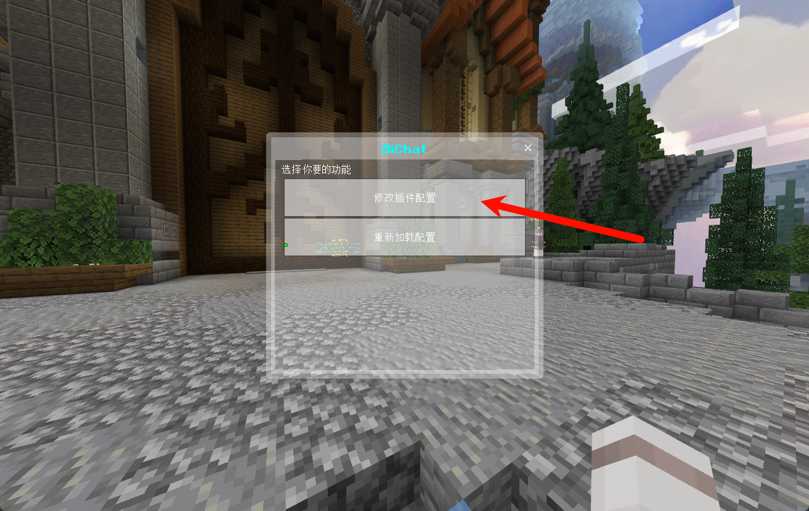

# AiChat-For-Nukkit
### nukkit上的ai聊天插件
#### 本教程是人就可以看懂，而且不需要任何花费，就可以免费让你的nukkit服务器使用ai聊天
#### 支持功能
| 功能         | 是否支持 | 描述                      |
|------------|--|-------------------------|
| 联系上下文      |√ | ai可以记得之前的聊天记录           |
| 前缀触发       |√ | ---                     |
| 各个玩家分离     |√ | 每一个玩家的聊天记录是分来的          |
| 标准OPENAI接口 |√ | 支持对接大部分AI模型接口           |
| 携带prompt   |√ | 可以修改prompt.txt,来让ai具有个性 |
| 多语言        |√ | 可以修改配置文件语言配置文件路径        |
| 通过游戏表单配置   |√ | 可以通过游戏表单来修改配置文件         |
#### 快速开始
1. 将插件放置到plugins文件夹下
2. 进入服务器
3. 输入/aichat命令
4. 点击`修改插件配置`

5. 获取api_key(获取链接：https://github.com/chatanywhere/GPT_API_free)
6. 点击`申请内测免费Key`(需要github账号)

7. 复制sk开头的这一串

8. 粘贴到`接口地址`处

9. 滑到下面，点击提交(你也可以选择修改触发前缀)

10. 出现这个说明配置好了

11. 在聊天了发送带前缀的消息，就会触发AI聊天

#### 常见问题
1. 当出现错误，控制台会显示错误码

| 错误码            | 描述                                                                                                                       |
|----------------|--------------------------------------------------------------------------------------------------------------------------|
| 400 - 格式错误     | 原因：请求体格式错误<br/>解决方法：请根据错误信息提示修改请求体                                                                                       |
| 401 - 认证失败     | 原因：API key 错误，认证失败<br/>解决方法：请检查您的 API key 是否正确，如没有 API key，请先 [获取 API key](https://github.com/chatanywhere/GPT_API_free) |
| 402 - 余额不足     | 原因：账号余额不足<br/>解决方法：如果你用的其他接口可能需要充值                                                                                       |
| 403 - 请求失败     | 原因：请求体参数错误<br/>解决方法：请根据错误信息提示修改相关参数                                                                                      |
| 429 - 请求速率达到上限 | 原因：请求速率（TPM 或 RPM）达到上限<br/>解决方法：请合理规划您的请求速率。你也可能触发每日限额了，第二天就好了。                                                          |
| 500 - 服务器故障    | 原因：服务器内部故障<br/>解决方法：请等待后重试。                                                                                                                     |
| 503 - 服务器繁忙    | 原因：服务器负载过高<br/>解决方法：请稍后重试您的请求                                                                                                                      |

#### 配置文件内容
config.yml
```yaml
# 语言配置路径
Language: "chs.yml"

# 打开配置表单的命令
OpenFormCmd: "aichat"

# API地址
api_url: "https://api.chatanywhere.tech/v1/chat/completions"

# API密钥，用于身份验证，此处为空，实际使用时需要填写
api_key: ""

# 最大请求次数，限制与服务端的交互频率
maxRequestNum: 5

# prompt文本文件路径
prompt: "prompt.txt"

# 触发命令前缀列表，用于识别何时启动AI对话
triggerPrefix:
  - "星空酱"
  - "帮帮我"
  - "星酱"
  - "s"


```
requestJson.json

换用其他接口要注意修改`model`,其他配置不清楚就不要动
```json
{
  "messages": ["messages"],
  "user": "%playerName%",
  "model": "gpt-3.5-turbo",
  "frequency_penalty": 0,
  "max_tokens": 2048,
  "presence_penalty": 0,
  "stop": null,
  "stream": false,
  "temperature": 1,
  "top_p": 1,
  "logprobs": false,
  "top_logprobs": null
}
```
下载：https://github.com/szzz666/AiChat-For-Nukkit/releases
#### 反馈渠道
如果遇到任何bug，请加入Q群进行反馈：
- **Q群号码**: 894279534
